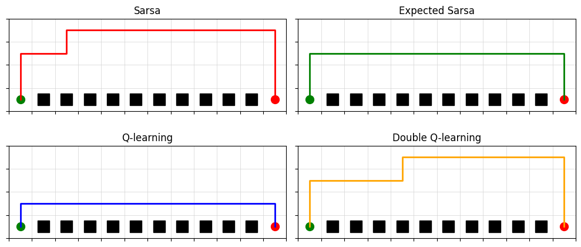
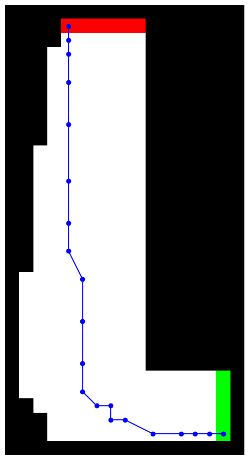
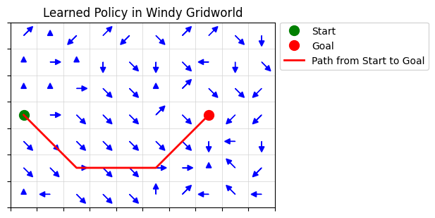

# Reinforcement Learning Exercises

This folder contains my implementations of exercises and examples from _Reinforcement Learning: An Introduction_ (Sutton & Barto), primarily as runnable Jupyter notebooks.

## Contents

- Chapter 2 — Multi-armed Bandits
- Chapter 4 — Dynamic Programming
- Chapter 5 — Monte Carlo
- Chapter 6 — Temporal-Difference Learning

## Notebooks

- `ch_2_Bandits.ipynb`
- `ch_4_DP_p1_grid_problem.ipynb`
- `ch_4_DP_p2_car_rental.ipynb`
- `ch_4_DP_p3_gambler.ipynb`
- `ch_5_MC_p1_racetrack.ipynb`
- `ch_6_TD_p1_random_walk.ipynb`
- `ch_6_TD_p2_windy_gridworld.ipynb`
- `ch_6_TD_p3_cliff_walking.ipynb`

`toc.py` is a small helper script to keep a lightweight table-of-contents for this folder.

## Sample outputs

The `files/` directory contains a few representative figures generated by the notebooks.

### Cliff Walking (TD control)

### Racetrack (Monte Carlo control)

### Windy Gridworld (TD control)

## Running

- Open any notebook in VS Code or Jupyter and run cells top-to-bottom.
- If you use a virtual environment, install the usual scientific stack (e.g., `numpy`, `matplotlib`).
